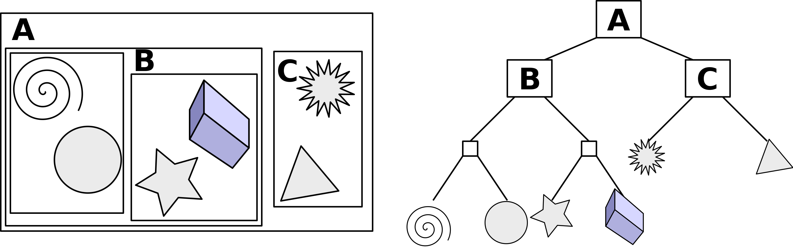

# Extending Ray Tracer
This project aims to achieve the following features that are not implemented in the ray tracer from Lab3: Monte Carlo path tracing, textures, light sources, Bounding Volume Hierarchies, motion blur, defocus blur. 

Note on Monte Carlo Path Tracing: the ray tracer implemented in Lab3 is using path tracing, but it is not Monte Carlo path tracing. I had a hard time incorporating the mathemetical concept for the path tracing into the existing ray tracer algorithm, so I wasn't able to implement Monte Carlo path tracing.

## Minumum Required Features
1. Monte Carlo Path Tracing (completed by May 13) 
2. Textures (completed by May 14)
This features allows objects to have customized texture. For example, an image could be the texture of a sphere. To implement this features, a new class will need to be created for texture. In addition, texture coordinates (u, v) for each hittable objects(sphere, triangle, and plane) need to be calculated. For sphere, we could parameterize . For triangle, barycentric coordinates will be used to calculate the texture coordinates within a triangle. 
3. Light Sources (completed by May 15)
This feature allows objects to become a light source. To implement this feature, a new material will be added that with similar structure to lambertian material, but there is no scattering for the light source material. 
4. Motion Blur (complete by May 17)
This feature will produce an image that looks like the object is moving. Below is an image of motion blur for sphere. To implement motion blur, the ray and camera will need to have additional parameters recording the start time and end time for casting rays.

5. Defocus Blur (completed by May 17)
This feature will make the camera similar to a lens. An object that is in a specific distance to the camera will be clear, but the object that is too far or too close to the camera will be blurry.

## Option Features (Stretch Goals)
1. Bounding Volume Hierarchies (BVH)
The feature is a tree structure for geometric structures. In this data structure, every geometric shape is bounded by a box, and for this project, axis-align-bounding-box will be used to easier implementation. Every bounding box can be considered as a node of the tree. Instead of detecting ray collision with the objects, BVH takes advantage of the bounding box, and look for ray collision with the bounding boxes which will reduce the runtime for ray tracer to logarithmic runtime. Below is an image of the design of BVH

