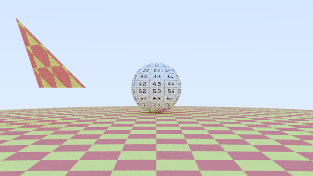
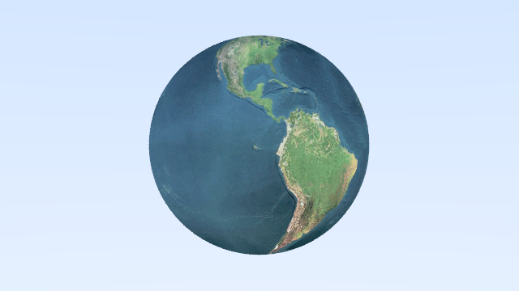
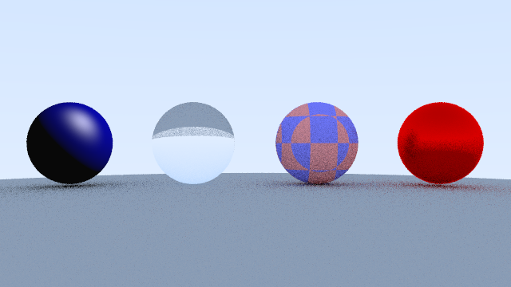
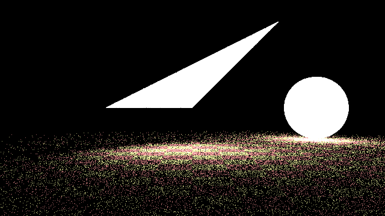
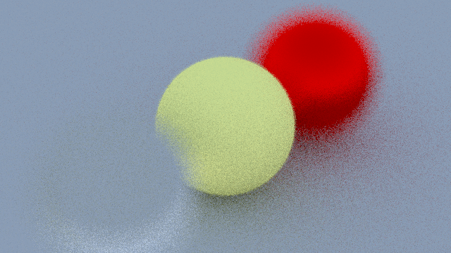
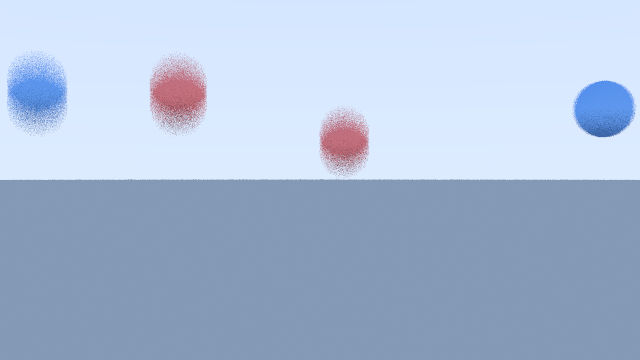
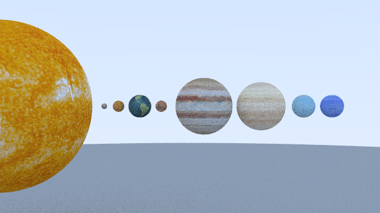

# CS312 Final Project
This project is an extension of the ray tracer implemented in Lab3. There are two main features implemented in this project (textures and arbitrary light sources) and some additional features (defocus blur and motion blur).

## How to build

*Windows*

Open git bash to the directory containing this repository.

```
raytracer $ mkdir build
raytracer $ cd build
raytracer/build $ cmake -G "Visual Studio 16 2019" ..
raytracer/build $ start CS312-FinalProject.sln
```
To run the program, set "materials" as the starup project in Visual Studio and run it.

To recreate different images, change the variable "cases" in materials.cpp on line 95 to numbers between 0 and 6. 
## Textures
This feature allows sphere and triangles to have the following implemented textures. 
### Implemented textures
1. Constant Texture
    The constant texture is used to hold a color. In lambertian material, the orignal albedo color is replaced by a texture so that lambertian material can have different textures.
2. Checker Texture
This texture is used to create a checker texture which allows two kinds of texture (or color) to appear in alternating pattern. 
3. Image Texture 
This texture allows am image to be mapped on sphere and triangle. 
### Sample Image





## Arbitrary Light Sources
This feature allows sphere, triangles, and plane to become a light source. In the project, one addtional material called "emit_light" was added. This material will not scatter light and could serve as a light source. 

### Sample Image


## Other features
### Defocus Blur
This feature is similar to the functionality of a lens. When an object is in a specific distance to the camera, it will be clear. However, when the object is too close or too far away from the camera, it will be blurry. 

#### Sample Image


### Motion Blur
This feature allows the sphere to have a blurry effect that looks like the sphere is moving. To implement this feature, a new hittable object called "moving_sphere" is created, and it has similar hit() function to the sphere. The difference is that the center of the moving_sphere is a function of time. The ray and camera is also updated to have a record of time. The scattered ray for materials is also updated because ray now has an extra parameter of time.

#### Sample Image


## Images




